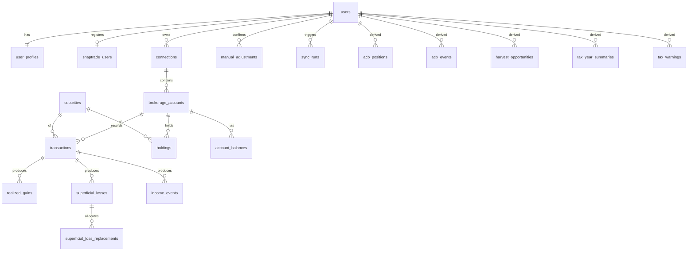

# Database Schema

Neon Postgres (17-compatible) with Drizzle ORM.
The source of truth is `src/server/db/schema.ts` (app tables) and `src/server/db/auth-schema.ts` (Better Auth tables).
Migrations are generated into `drizzle/` with `pnpm db:generate` and applied with `pnpm db:migrate`.

## Principles

- One tenant is one user.
  Every user-owned row carries `user_id`, and children reference their parent through `(id, user_id)` composite keys, so a row can never point at another user's data.
- The database is reached only from server code, so there is no row-level security; every query helper takes `userId` first.
- Money is `numeric(20,6)`, quantities `numeric(28,10)`, FX rates and split ratios `numeric(20,10)`, tax rates `numeric(6,5)`.
  Drizzle returns them as strings, which go straight into decimal.js.
- Engine dates (`YYYY-MM-DD`) are `date`; system times are `timestamptz`.
- Allowed values are `CHECK` constraints that mirror the engine's TypeScript unions, not Postgres enums, so adding a value is a one-line migration.
- The engine's own ledger rules (`validateLedger`) are repeated as constraints, so a bad seed or manual fix fails at insert.
- Derived tables are a cache of `computeTax()` output.
  `replaceDerived` (`src/server/db/derived.ts`) deletes and reinserts them per user in one transaction, so they never drift from the ledger.

## Tables

| Group | Tables |
| --- | --- |
| Auth (Better Auth) | `users`, `sessions`, `accounts` (OAuth links), `verifications` |
| Profile | `user_profiles` (demo flag, marginal rate, last sync), `snaptrade_users` (encrypted `userSecret`) |
| Brokerage data | `connections`, `brokerage_accounts`, `securities` (global), `transactions`, `holdings`, `account_balances` |
| User input | `manual_adjustments` (opening quantity and ACB) |
| Reference | `fx_rates` (Bank of Canada, global) |
| Operational | `sync_runs` |
| Derived | `acb_positions`, `acb_events`, `realized_gains`, `superficial_losses`, `superficial_loss_replacements`, `income_events`, `harvest_opportunities`, `tax_year_summaries`, `tax_warnings` |

## Design Decisions

- User data uses UUID keys because ids appear in URLs and should not be guessable.
- `securities` is global and keyed by SnapTrade's universal symbol id, so the same stock at two brokerages is one row and pooled ACB is a plain `GROUP BY`.
- `transactions` mirrors the engine's `LedgerEntry`, so `toLedger` (`src/server/db/ledger.ts`) is a mapping, not logic.
- `transactions.raw` keeps the original SnapTrade activity, so a mapping fix can be replayed without a re-sync.
  It is the only JSON column that holds data, and nothing queries into it.
- `brokerage_accounts.account_type_confirmed_at` is null while the type is only SnapTrade's guess; the UI asks the user to confirm.
- `holdings.broker_book_value` is kept for comparison only and is never used for ACB.
- `acb_events` points at either a transaction or the manual adjustment behind an opening balance, enforced by a check that exactly one is set.
- A partial unique index allows one running sync per user, which blocks double clicks and cron overlapping a manual refresh.
- A partial unique index allows only one demo user.
- `users.email` must be lowercase, which makes its unique constraint case-insensitive.
- The app uses the WebSocket `Pool` driver (`drizzle-orm/neon-serverless`), not `neon-http`, because recompute needs an interactive transaction.

## Query-to-Index Map

| Query | Served by |
| --- | --- |
| Hub: connections and accounts by brokerage | `idx_connections_user`, `idx_brokerage_accounts_user` |
| Hub: pooled investments | `acb_positions_pkey` + `idx_holdings_user` |
| Hub: per-account holdings | `holdings_account_security_key` |
| Hub: alerts | `idx_tax_warnings_user`, `idx_superficial_losses_pending` |
| Account detail: activity, newest first | `idx_transactions_account_date` |
| Security detail: ACB breakdown in order | `acb_events_pkey` |
| Security detail and recompute: ledger by user | `idx_transactions_user_security_date` |
| Tax Center year | `idx_realized_gains_user_year`, `idx_income_events_user_year`, `idx_superficial_losses_user_year`, `tax_year_summaries_pkey` |
| Harvesting suggestions | `harvest_opportunities_pkey` |
| Sync upsert | `transactions_account_activity_key` and the unique SnapTrade ids on connections, accounts, and securities |
| FX rate on or before a date | `fx_rates_pkey` |
| Refresh once per 15 minutes | `idx_sync_runs_user_started` |
| Delete my data and demo reset | `ON DELETE CASCADE` from `users`, with every cascading column indexed |

## Functionality the Schema Supports

### Now

1. Sign in with GitHub or Google, or one-click demo login.
2. Register with SnapTrade and store the `userSecret` encrypted.
3. Connect and reconnect brokerages, and block new connections at the free plan's 5-account cap.
4. Sync accounts, balances, holdings, and every page of activities idempotently.
5. Limit Refresh to once per 15 minutes, run the daily cron, and show the last sync and its errors.
6. Confirm each account's type, which decides exclusion from gains and inclusion in superficial loss checks.
7. Pool ACB across every non-registered account at every brokerage, with the broker's book value alongside for comparison.
8. Show a step-by-step ACB breakdown per security, including superficial loss adjustments and opening balances.
9. Show each account's activity and holdings.
10. Show Hub totals (holdings plus cash in CAD), YTD gains, estimated tax, and allocation by account type, brokerage, currency, and security type.
11. Alert on open superficial loss windows, losses lost forever in a registered account, positions needing an opening balance, and years with assumed rates.
12. Record an opening quantity and ACB when history is incomplete.
13. Show the Tax Center per year: Schedule 3 gains, superficial losses with their replacements, and dividends by class with gross-up, credit, and withholding.
14. Suggest tax-loss harvesting with safe-sale and no-rebuy dates, plus estimated savings when the user sets a marginal rate.
15. Export any Tax Center table as CSV.
16. Convert foreign currency at the Bank of Canada rate with a previous-business-day fallback.
17. Delete all of a user's data with one statement, and reset the demo daily.

### Later

- CSV import from brokerage exports: add `connections.source` and an `import_batches` table, and make the SnapTrade ids nullable per source.
- PDF tax report: reads the same derived tables with no schema change.
- Net capital loss carryforward: `tax_year_summaries` already stores a signed taxable gain per year; add the applied carryforward and a user-entered prior balance.
- TFSA, RRSP, and FHSA contribution room: add a `contribution_room` table and derive contributions from registered-account deposits.
- Provincial tax estimate: add `user_profiles.province` and a per-year provincial rate config.
- Broker versus TaxBack ACB reconciliation: `holdings.broker_book_value` already joins to `acb_positions`.
- Transaction overrides, such as reclassifying a dividend: add a `transaction_overrides` table that recompute applies.
- Transfers between accounts with ACB carried over: add a `transfer_pair_id` linking both sides.
- Spouse and affiliated-person superficial loss checks: add `households` and `household_members`.
- Price history and performance charts: add `security_prices`, keyed like `fx_rates`.
- What-if sale simulator: an engine call over the stored ledger with no schema change.
- Reminders before a superficial loss window closes: `idx_superficial_losses_pending` already serves this.
- Recompute audit trail: add `recompute_runs` with an input hash and engine version.
