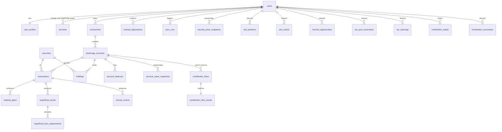

# Database Schema

Neon Postgres (17-compatible) with Drizzle ORM.
The source of truth is `src/server/db/schema.ts` (app tables) and `src/server/db/auth-schema.ts` (Better Auth tables).
Migrations are generated into `drizzle/` with `pnpm db:generate` and applied with `pnpm db:migrate`.

## Principles

- One tenant is one user.
  Every user-owned row carries `user_id`, and children reference their parent through `(id, user_id)` composite keys, so a row can never point at another user's data.
  This includes the derived tables: each one references its transaction, account, loss, or manual adjustment by `(id, user_id)`, so a recompute bug cannot attach one user's result to another user's ledger.
- The database is reached only from server code, so there is no row-level security; every query helper takes `userId` first.
- Money is `numeric(20,6)`, quantities `numeric(28,10)`, FX rates and split ratios `numeric(20,10)`, tax rates `numeric(6,5)`.
  Drizzle returns them as strings, which go straight into decimal.js.
- Engine dates (`YYYY-MM-DD`) are `date`; system times are `timestamptz`.
- Allowed values are `CHECK` constraints that mirror the engine's TypeScript unions, not Postgres enums, so adding a value is a one-line migration.
- The engine's own ledger rules (`validateLedger`) are repeated as constraints, so a bad seed or manual fix fails at insert.
- Derived tables are a cache of `computeTax()` output.
  `replaceDerived` (`src/server/db/derived.ts`) deletes and reinserts them per user in one transaction, so they never drift from the ledger.

## Tables

| Group | Tables |
| --- | --- |
| Auth (Better Auth) | `users`, `sessions`, `accounts` (Google and SnapTrade OAuth grants, tokens encrypted), `verifications`, `rate_limits` |
| Profile | `user_profiles` (demo flag, marginal rate, birth year, residency, first FHSA year, last sync) |
| Brokerage data | `connections`, `brokerage_accounts`, `securities` (global), `transactions`, `holdings`, `account_balances` |
| User input | `manual_adjustments` (opening quantity and ACB), `corporate_actions` (spinoffs and mergers), `security_preferences` (listing links and dividend class), `contribution_inputs` (CRA room figures, estimate inputs, deduction claimed) |
| Registered plan cash | `contribution_flows` (synced deposits, withdrawals, and transfers, plus manual entries, with the user's classification) |
| Reference | `fx_rates` (Bank of Canada, global) |
| Value history | `account_value_snapshots` (each account's CAD value per sync day), `security_price_snapshots` (CAD price per held security per sync day, per user so demo prices never reach real users) |
| Operational | `sync_runs` |
| Derived | `acb_positions`, `acb_events`, `realized_gains`, `superficial_losses`, `superficial_loss_replacements`, `income_events`, `harvest_opportunities`, `tax_year_summaries`, `tax_warnings`, `position_reconciliations`, `contribution_flow_results`, `contribution_summaries` |

## Design Decisions

- User data uses UUID keys because ids appear in URLs and should not be guessable.
- `securities` is global and keyed by SnapTrade's universal symbol id, so the same stock at two brokerages is one row and pooled ACB is a plain `GROUP BY`.
- `transactions` mirrors the engine's `LedgerEntry`, so `toLedger` (`src/server/db/ledger.ts`) is a mapping, not logic.
- `transactions.raw` keeps the original SnapTrade activity, so a mapping fix can be replayed without a re-sync.
  It is the only JSON column that holds data, and nothing queries into it.
- `brokerage_accounts.account_type_confirmed_at` is null while the type is only SnapTrade's guess; the UI asks the user to confirm.
- `brokerage_accounts.kind` is `investment` or `cash`; cash accounts count toward value only, and the UI never asks for their type.
- `holdings.broker_book_value` is kept for comparison only and is never used for ACB.
- `securities.figi_share_class` is shared by every listing of the same shares. Recompute maps listings
  with the same value (or linked in `security_preferences`) to one canonical id before the engine runs,
  so derived rows always use the canonical id (`src/server/db/pools.ts`).
- `security_preferences` is per user, because a link or a dividend class choice must not change other
  users' results. `pool_security_id` equal to `security_id` means "keep separate".
- `acb_events` points at exactly one source: a transaction, the manual adjustment behind an opening balance, or a corporate action, enforced by a check.
  Each event also stores the `rule` applied and the `fx_rate` used, which makes it the audit trail behind every ACB figure.
- `realized_gains` points at a transaction or, for the cash part of a merger, a corporate action; a merger has no account, so `account_id` is null for it.
- `corporate_actions` are user input applied to the whole security, so they carry no account. Their checks mirror the engine's validation (a spinoff needs both fair market values, a merger with cash needs the new share's).
- `position_reconciliations` holds one row per security for the pooled non-registered position (`account_id` null, unique with `NULLS NOT DISTINCT`) and one per registered account.
- A partial unique index allows one running sync per user, which blocks double clicks and cron overlapping a manual refresh.
- A partial unique index allows only one demo user.
- `users.email` must be lowercase, which makes its unique constraint case-insensitive.
- The app uses the WebSocket `Pool` driver (`drizzle-orm/neon-serverless`), not `neon-http`, because recompute needs an interactive transaction.
- The demo user always has the id `demo` and the email `demo@taxback.invalid`; `.invalid` is a reserved TLD, so no OAuth provider can verify that address and claim the account.
- `rate_limits` backs Better Auth's rate limiter, because serverless instances share no memory.

## Rules for Writers

These hold for code not yet written; each is a way the schema alone cannot stop a bug.

- **Upsert on the per-user keys.**
  SnapTrade connection and account ids are unique per user (`connections_user_authorization_key`, `brokerage_accounts_user_snaptrade_key`), because an OAuth user can share one connection with others.
  Every sync upsert targets those `(user_id, snaptrade_id)` keys, so it can only ever update the signed-in user's rows.
- **Recover stale sync locks.**
  `sync_runs_one_running_key` allows one `running` row per user.
  A function that dies mid-sync leaves that row behind and would block the user forever, so a sync first marks `running` rows older than the function timeout as `failed`.
- **Securities match on SnapTrade id, then on `(symbol, exchange, currency)`.**
  Demo-only securities have no SnapTrade id but share the natural key with real ones, so a real sync inserting `RY / TSX / CAD` would hit `securities_symbol_exchange_currency_key`.
  The upsert falls back to the natural key and adopts the SnapTrade id.
- **Serialize token refreshes per user.**
  SnapTrade rotates refresh tokens: using one invalidates it.
  Two concurrent refreshes for one user (cron and the Refresh button) would leave one holding a dead token and force the user to sign in again.
  Read the access token through `auth.api.getAccessToken` only inside a sync that holds the user's `sync_runs` lock.
- **Parse SnapTrade money as decimals.**
  The API returns prices, units, and amounts as JSON numbers.
  Validate each response with zod and convert with `new Decimal(String(n))` in the activity mapper and nowhere else.

## Query-to-Index Map

| Query | Served by |
| --- | --- |
| Hub: connections and accounts by brokerage | `connections_user_authorization_key`, `brokerage_accounts_user_snaptrade_key` (both lead with `user_id`) |
| Hub: pooled investments | `acb_positions_pkey` + `idx_holdings_user` |
| Hub: per-account holdings | `holdings_account_security_key` |
| Hub: alerts | `idx_tax_warnings_user`, `idx_superficial_losses_pending` |
| Account detail: activity, newest first | `idx_transactions_account_date` |
| Security detail: ACB breakdown in order | `acb_events_pkey` |
| Security detail: corporate actions, either side | `idx_corporate_actions_security`, `idx_corporate_actions_target` |
| Hub: value over time, optionally per brokerage | `idx_account_value_snapshots_user_day` |
| Hub: sparklines, last 90 days | `security_price_snapshots_pkey` (leads with `user_id`) |
| Hub: ledger vs broker | `position_reconciliations_key` (leads with `user_id`) |
| Security detail and recompute: ledger by user | `idx_transactions_user_security_date` |
| Tax Center year | `idx_realized_gains_user_year`, `idx_income_events_user_year`, `idx_superficial_losses_user_year`, `tax_year_summaries_pkey` |
| Harvesting suggestions | `harvest_opportunities_pkey` |
| Sync upsert | `connections_user_authorization_key`, `brokerage_accounts_user_snaptrade_key`, `transactions_account_activity_key`, and `securities.snaptrade_symbol_id` |
| FX rate on or before a date | `fx_rates_pkey` |
| Refresh once per 15 minutes | `idx_sync_runs_user_started` |
| Delete my data and demo reset | `ON DELETE CASCADE` from `users`, with every cascading column indexed |

## Functionality the Schema Supports

### Now

1. Sign in with Google or SnapTrade, connect SnapTrade later to a Google account, or use the one-click demo login.
2. Keep the SnapTrade OAuth grant (encrypted access and refresh tokens) keyed on the SnapTrade user id.
3. Track each brokerage connection and its status; users repair broken ones in the SnapTrade Dashboard.
4. Sync accounts, balances, holdings, and every page of activities idempotently.
5. Limit Refresh to once per 15 minutes, run the daily cron, and show the last sync and its errors.
6. Confirm each account's type, which decides exclusion from gains and inclusion in superficial loss checks.
7. Pool ACB across every non-registered account at every brokerage, with the broker's book value alongside for comparison.
8. Show a step-by-step ACB audit trail per security, with the rule and exchange rate behind each step, including superficial loss adjustments, opening balances, transfers, and corporate actions.
9. Show each account's activity and holdings.
10. Show Hub totals (holdings plus cash in CAD), YTD gains, estimated tax, and allocation by account type, brokerage, currency, and security type.
11. Alert on open superficial loss windows, losses lost forever in a registered account, positions needing an opening balance, and years with assumed rates.
12. Record an opening quantity and ACB when history is incomplete, and spinoffs and mergers that brokers do not report; compare the replayed ledger with broker positions and show the share that match.
13. Show the Tax Center per year: Schedule 3 gains, superficial losses with their replacements, and dividends by class with gross-up, credit, and withholding.
14. Suggest tax-loss harvesting with safe-sale and no-rebuy dates, plus estimated savings when the user sets a marginal rate.
15. Export any Tax Center table as CSV.
16. Convert foreign currency at the Bank of Canada rate with a previous-business-day fallback.
17. Delete all of a user's data with one statement, and reset the demo daily.
18. Track contributions and withdrawals for every registered plan, room for TFSA, RRSP, and FHSA from CRA's figures or an estimate, and the Schedule 7 and Schedule 15 amounts.

### Later

- CSV import from brokerage exports: add `connections.source` and an `import_batches` table, and make the SnapTrade ids nullable per source.
- PDF tax report: reads the same derived tables with no schema change.
- Net capital loss carryforward: `tax_year_summaries` already stores a signed taxable gain per year; add the applied carryforward and a user-entered prior balance.
- Provincial tax estimate: add `user_profiles.province` and a per-year provincial rate config.
- Broker versus TaxBack ACB reconciliation: `holdings.broker_book_value` already joins to `acb_positions`.
- Transaction overrides, such as reclassifying a dividend: add a `transaction_overrides` table that recompute applies.
- Transfers between accounts with ACB carried over: add a `transfer_pair_id` linking both sides.
- Spouse and affiliated-person superficial loss checks: add `households` and `household_members`.
- Price history and performance charts: add `security_prices`, keyed like `fx_rates`.
- What-if sale simulator: an engine call over the stored ledger with no schema change.
- Reminders before a superficial loss window closes: `idx_superficial_losses_pending` already serves this.
- Recompute audit trail: add `recompute_runs` with an input hash and engine version.
